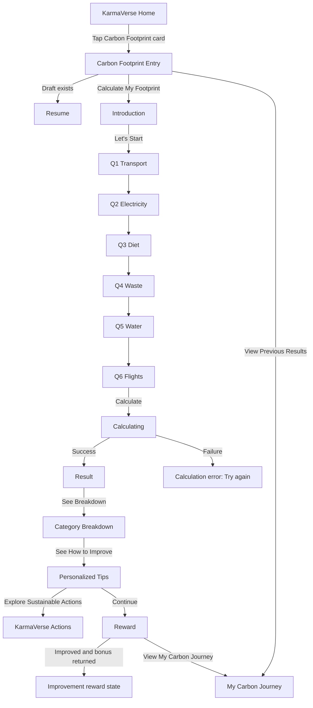
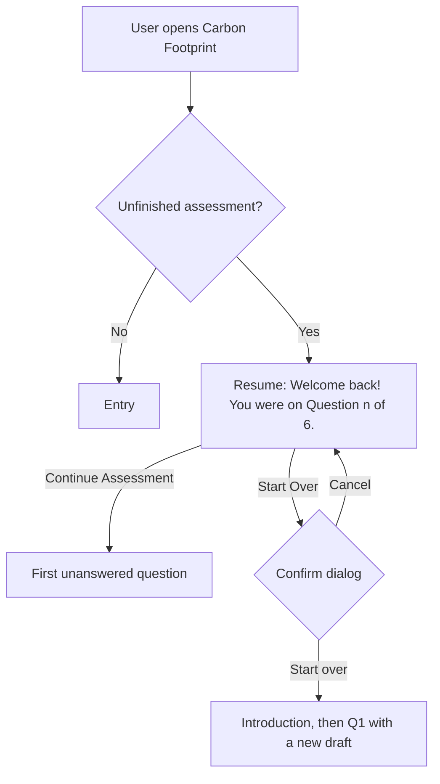

# KarmaVerse — Carbon Footprint: UX & UI Specification

**Feature:** Carbon Footprint (conversational assessment)
**Product:** KarmaVerse by 3RZeroWaste
**Platform:** Mobile-first (Android / iOS / mobile web), responsive to tablet and desktop web
**Status:** Design spec v1.0 — 28 Sep 2026
**Visual reference:** Design canvas "KarmaVerse Carbon Footprint Screens" — https://claude.ai/artifact/GTM22StLFpyCDe7hGTYaRU (one artboard per screen, same numbering as §4; clickable in Play mode)

---

## 0. Source of truth and guardrails

This spec designs the **UI only**. It does not change product logic or backend behavior.

The six-category logic below is taken from the product brief. `Carbon_Footprint_Feature_Overview.docx` could not be read while writing this spec, so **anything that only that document can settle is written as a `{placeholder}` and listed in §9, Open questions**. Nothing in this spec invents a reward amount, a score formula, a band threshold or an emission factor.

**Product rules the UI must preserve**

| # | Rule | What it means for the UI |
|---|------|--------------------------|
| P1 | Always 6 questions | Progress is always "Question *n* of 6". No branching, no skipping, no extra questions. |
| P2 | Fixed order: Transport → Electricity → Diet → Waste → Water → Flights | Question order is hard-coded in the client and never reordered. |
| P3 | Answers are natural free text | One multiline text field per question. No dropdowns, sliders or sub-forms. |
| P4 | AI only *interprets* answers | Copy may say AI "reads" or "understands" answers. It must **never** say AI "calculates", "estimates" or "decides" the footprint. |
| P5 | Deterministic formulas plus configurable conversion factors | The "How is this calculated?" sheet says fixed formulas and standard factors produce the number. |
| P6 | Results store the conversion-factor version used | The result and history detail show the factor version in small print. |
| P7 | Past assessments never change | History rows are read-only. There is no edit action on past results. |
| P8 | A new assessment creates a new record | "Calculate My Footprint" always starts a new record. |
| P9 | Completion can extend the engagement streak | The reward screen shows the streak block **only if** the API reports a streak update. |
| P10 | An improved footprint can earn bonus KarmaCoins | The improvement reward state shows **only if** the API returns an improvement bonus. |
| P11 | Users can view previous results | "View Previous Results" opens **My Carbon Journey**. |

**Copy rules**

- Say "we" for KarmaVerse. Use second person, short sentences and a Grade 6 reading level.
- Write in action language, never guilt language. Say "Your biggest opportunity", not "Your worst habit".
- Always write "kg CO₂e". Never write "carbon credits", "tonnes" or "emissions score". Use Indian digit grouping (`en-IN`) and dates as `28 Sep 2026`.
- Use "rough is fine" reassurance on every question. Users should never feel tested.

---

## 1. Information architecture

```
KarmaVerse
├── Home
│   └── Carbon Footprint card ──────────────► Carbon Footprint Hub (Entry)
├── Actions (existing)          ◄──────────── "Explore Sustainable Actions"
├── Wallet / KarmaCoins (existing) ◄──────── Reward screen "View Wallet"
└── Carbon Footprint
    ├── Entry (hub)                     /carbon
    │   ├── [in-progress draft] → Resume        /carbon/resume
    │   └── [has results]       → last-result card, "View Previous Results"
    ├── Introduction                    /carbon/intro
    ├── Assessment                      /carbon/a/:assessmentId/q/:n    (n = 1…6)
    │   └── Save & exit dialog
    ├── Calculating                     /carbon/a/:assessmentId/calculating
    ├── Result (hero)                   /carbon/r/:resultId
    │   └── "How is this calculated?" bottom sheet
    ├── Category Breakdown              /carbon/r/:resultId/breakdown
    ├── Personalized Tips               /carbon/r/:resultId/tips
    ├── Reward                          /carbon/r/:resultId/reward     (only right after completion)
    └── My Carbon Journey (history)     /carbon/journey
        └── Past result (read-only)     /carbon/r/:resultId?mode=past
```

**Entry points into the feature**
1. Home card "Carbon Footprint".
2. A deep link or push notification to `/carbon`.
3. Any Actions surface that links to it, for example "Know your footprint".

---

## 2. User flows

### 2.1 Primary flow



### 2.2 Resume flow



- "Last unanswered question" = the lowest *n* with no saved answer. Because order is fixed, this is always the answered count + 1.
- Resume appears **instead of** Entry when a draft exists. The user can still reach the hub with the "Back to Carbon Footprint" link on Resume.

### 2.3 In-assessment navigation

| Action | Result |
|--------|--------|
| Continue (Q1–Q5) | Saves the answer, then goes to Q*n+1* |
| "Calculate My Footprint" (Q6) | Saves the answer, then goes to Calculating |
| Back arrow (Q2–Q6) | Goes to Q*n−1* with the saved answer prefilled and editable |
| Back arrow (Q1) | Goes to Introduction |
| Close (X), any question | "Save & exit" dialog |
| Android system back | Same as the back arrow |

---

## 3. Global layout and components

### 3.1 Screen scaffold (all screens)

```
┌───────────────────────────────┐
│ Status bar (OS)               │
│ App bar 56 dp                 │  ← back or close · title · optional action
├───────────────────────────────┤
│ Scroll content                │  ← 20 dp side gutters, 24 dp top padding
│                               │
├───────────────────────────────┤
│ Bottom action bar (sticky)    │  ← primary CTA 52 dp; optional text button
│ + safe-area inset             │
└───────────────────────────────┘
```

### 3.2 Component hierarchy

```
CarbonFootprintFeature
├── CFAppBar                 {variant: back | close, title, trailingAction?}
├── CFBottomBar              {primary: Button, secondary?: TextButton}
├── Entry
│   ├── HeroIllustration
│   ├── WhyList → WhyItem ×3 {icon, text}
│   ├── MetaChips            {"6 questions", "About 3 min"}
│   └── LastResultCard?      {monthlyKg, date, onTap}
├── Intro
│   ├── ExplainerBlock
│   ├── HowItWorksSteps → Step ×3
│   └── CategoryGrid → CategoryChip ×6
├── QuestionScreen           ← ONE reusable component, driven by QUESTION_CONFIG[n]
│   ├── ProgressHeader       {current: n, total: 6}
│   │   └── SegmentedProgress (6 segments)
│   ├── CategoryBadge        {icon, label}
│   ├── QuestionText
│   ├── SupportText
│   ├── AnswerField          {value, placeholder, maxLength, state}
│   │   ├── HelperRow        {"Rough is fine" hint, char counter}
│   │   └── InlineMessage?   {kind: error | info}
│   ├── ExampleChip          {text, onTap → inserts nothing, just expands the example}
│   └── SaveNote             {"Your answers save as you go"}
├── Calculating
│   ├── PulseRing
│   └── StepList → StepRow ×3 {label, state: done | active | pending}
├── Result
│   ├── Eyebrow, MonthlyFigure, YearlyFigure
│   ├── ScoreGauge           {score, bandKey, bandLabel}
│   ├── BandScale            {bands[], activeKey}
│   ├── BiggestContributorTeaser
│   └── MethodSheet (bottom sheet)
├── Breakdown
│   ├── BiggestContributorCard
│   └── CategoryBarList → CategoryBarRow ×6 {icon, label, kg, pct, isTop}
├── Tips
│   ├── OpportunityHeader    {category}
│   └── TipCard ×3           {icon, title, body}
├── Reward
│   ├── CoinBurst
│   ├── CoinsEarnedCard      {coins}
│   ├── StreakCard?          {count, unit}
│   └── ImprovementCard?     {previousKg, currentKg, deltaKg, deltaPct, bonusCoins}
├── Journey
│   ├── CurrentVsPreviousCard
│   ├── TrendChart           {points[]}  + table fallback
│   └── AssessmentList → AssessmentRow ×n {date, kg, changeChip}
└── Resume
    ├── ProgressSummary      {answered[], current}
    └── ConfirmStartOverDialog
```

### 3.3 Question config (drives the reusable Question screen)

Question wording, support text and examples are **content**. They live in one config and can be changed without touching layout. Final wording must be checked against the spec document (§9, Q3).

| n | key | Icon | Question | Support text | Placeholder (example answer) |
|---|-----|------|----------|--------------|------------------------------|
| 1 | `transport` | bike | How do you usually travel to work or college, and roughly how far each day? | Mention your vehicle and fuel if you know it. Rough distances are fine. | I travel around 15 km daily on my petrol bike. |
| 2 | `electricity` | bolt | How much electricity does your home use in a month? | Your bill amount or the units on your bill both work. A rough number is fine. | Our bill is around ₹1,800 a month, roughly 220 units. |
| 3 | `diet` | plate | What does a typical week of meals look like for you? | Tell us what you usually eat — veg, non-veg, eggs, dairy — and how often. | Mostly vegetarian. Chicken twice a week, and milk and curd every day. |
| 4 | `waste` | bin | How much waste does your home throw out, and do you segregate or recycle any of it? | For example: one small bin a day, wet and dry waste separated. | About one small bin a day. We separate wet and dry waste and give plastic to the kabadiwala. |
| 5 | `water` | drop | How do you use water at home on a typical day? | Baths or showers, washing machine, gardening — whatever comes to mind. | One bucket bath a day, and the washing machine runs three times a week. |
| 6 | `flights` | plane | How many flights have you taken in the last 12 months? | Rough routes help. "None" is a perfectly good answer. | Two return trips, Delhi to Mumbai. No international flights. |

The last question's CTA reads **"Calculate My Footprint"**. All others read **"Continue"**.

### 3.4 Data the UI expects (read-only contract)

The UI renders only fields that the backend already produces per the product logic. The names are suggestions for the frontend model; map them to the real API.

```ts
type Result = {
  id: string; createdAt: string;           // ISO
  monthlyKg: number; yearlyKg: number;     // shown as-is, UI never multiplies
  score: number;                           // 0–100
  band: { key: 'low' | 'medium' | 'high'; label: string }; // label from backend, e.g. "Medium Impact"
  categories: { key: CategoryKey; kg: number; pct: number }[]; // exactly 6, pct pre-rounded to total 100
  topCategory: CategoryKey;
  factorVersion: string;                   // e.g. "2026.2"
};
type Reward = {
  completionCoins: number | null;
  streak: { count: number; unit: 'day' | 'week'; extended: boolean } | null;
  improvement: { previousKg: number; currentKg: number; bonusCoins: number } | null;
};
type Draft = { id: string; answeredKeys: CategoryKey[]; answers: Record<CategoryKey, string> };
```

- The UI **never** computes kg, score, band, percentages or rewards. It formats values only.
- If `pct` is not provided, the client may compute `round(kg / monthlyKg × 100)` for display only.

---

## 4. Screen-by-screen specification (Figma-ready)

Frame: **390 × 844** (iPhone 14/15, Android ~393). Gutters 20. Grid: 4 columns, gutter 12. Frame names match the canvas artboards.

---

### 4.1 `01 Entry` — Carbon Footprint Entry

| Field | Spec |
|---|---|
| **Purpose** | Explain the feature in one glance and start an assessment or open past results. |
| **Layout** | App bar, then hero card (illustration + title + explanation), then "Why calculate?" list, then meta chips, then last-result card (conditional). Sticky bottom bar with 2 actions. |
| **Header** | Back arrow (to Home). Title "Carbon Footprint". Trailing: none. |
| **Components** | HeroIllustration (earth + leaf, 160 dp tall, on `green-50` card, radius 24) · H1 · Body-L · WhyList ×3 · MetaChips ×2 · LastResultCard (conditional) |

**Copy**
- H1: **Carbon Footprint**
- Body: **See how your everyday habits add up — and find simple ways to lower your impact.**
- Section title: **Why calculate your footprint?**
  - Leaf icon: **Know where your footprint comes from**
  - Target icon: **Get tips that fit your lifestyle**
  - Coin icon: **Earn KarmaCoins as you improve**
- Chips: **6 questions** · **About 3 minutes**
- LastResultCard (only if there is at least 1 result): overline **YOUR LAST RESULT**, value **184 kg CO₂e / month**, caption **28 Sep 2026 · Medium Impact**, chevron.

| CTA | Label | Destination |
|---|---|---|
| Primary | **Calculate My Footprint** | Introduction |
| Secondary (text button) | **View Previous Results** | My Carbon Journey |

**States**
| State | Behavior |
|---|---|
| First-time (no results) | LastResultCard hidden. "View Previous Results" hidden. |
| Returning (≥1 result) | LastResultCard shown, plus "View Previous Results". |
| Draft exists | Screen not shown. The route goes to **Resume** (§4.10). |
| Loading | Skeleton: hero block plus 3 list lines. CTAs disabled until the draft/history check returns (target < 400 ms). |
| Error (history fetch failed) | Screen still usable. LastResultCard hidden. "View Previous Results" stays visible and shows the Journey error state if it fails again. |

---

### 4.2 `02 Intro` — Assessment Introduction

| Field | Spec |
|---|---|
| **Purpose** | Set expectations: what a footprint is, what the user will do, and that plain language is fine. |
| **Layout** | App bar, then "What's a carbon footprint?" block, then "How it works" 3 steps, then "What we'll ask about" category grid (3×2), then reassurance note. Sticky CTA. |
| **Header** | Back arrow (to Entry). Title "Before we start". |

**Copy**
- H1: **What's a carbon footprint?**
- Body: **It's the total greenhouse gases your daily life adds to the air — from how you travel to what's on your plate. We measure it in kg CO₂e (carbon dioxide equivalent).**
- H3: **How it works**
  1. **Answer 6 quick questions** — one at a time.
  2. **Reply in your own words** — like you're texting a friend.
  3. **See your footprint** — plus tips to lower it.
- H3: **What we'll ask about**
- Category grid (icon + label): **Transport · Electricity · Diet · Waste · Water · Flights**
- Note (info icon, `green-50` bg): **About 3 minutes. No exact numbers needed — rough guesses are fine.**

| CTA | Label | Destination |
|---|---|---|
| Primary | **Let's Start** | Creates a draft, then Q1 |
| Secondary | — | — |

**States**: Default. **Starting** (spinner in the CTA, label "Starting…", while the draft is created). **Error**: snackbar "Couldn't start right now. Please try again." with a Retry action.

---

### 4.3 `03 Question` — Reusable Question screen (×6)

| Field | Spec |
|---|---|
| **Purpose** | Collect one free-text answer per category, one at a time. |
| **Layout** | App bar with progress, then category badge, then question (H2), then support text, then large answer field (min 5 lines, 160 dp, grows to 8 lines then scrolls), then helper row, then "Your answers save as you go". Sticky CTA above the keyboard. |
| **Header** | Leading: back arrow. Center: **Question {n} of 6**. Trailing: close (X) with aria-label "Save and exit". Below: 6-segment progress bar (segments ≤ *n* filled `green-600`; the current one pulses once on enter). |
| **Components** | ProgressHeader · CategoryBadge (32 dp icon tile + overline label, e.g. **TRANSPORT**) · QuestionText (H2) · SupportText (Body, `ink-2`) · AnswerField · HelperRow · SaveNote |

**AnswerField**
- Label (visually hidden, read by screen reader): the question text.
- Placeholder: the category example from §3.3, prefixed **"e.g. "**, in `ink-3`, italic.
- Helper (left): **Rough is fine — write it however you like.** Counter (right): `{count}/500`, shown after 400 characters. The 500 limit is a placeholder (§9).
- Keyboard: sentence case, autocorrect on, return key = newline. The CTA handles submit. Voice typing via the OS keyboard mic is supported and encouraged.

**Copy per question**: see §3.3.

| CTA | Label | Destination |
|---|---|---|
| Primary | **Continue** (Q1–Q5) / **Calculate My Footprint** (Q6) | Q*n+1* / Calculating |
| Back | Arrow | Q*n−1* (Q1 goes to Intro) |
| Close | X | Save & exit dialog |

**States**
| State | Visual | Copy |
|---|---|---|
| Empty | CTA disabled (`green-600` at 40%, `aria-disabled`) | Placeholder visible |
| Typing / valid | CTA enabled once trimmed text ≥ 2 chars | — |
| Prefilled (came back) | Saved answer in the field, CTA enabled | — |
| Saving | CTA spinner, field read-only | "Saving…" (screen reader) |
| Save failed (network) | Snackbar; text kept in the field | **Couldn't save your answer. Check your connection and try again.** [Retry] |
| Couldn't understand (backend says the answer is not interpretable, if the spec supports this) | Amber inline message under the field; field border `warning` | **We couldn't quite read that. Try adding a detail like distance, amount or how often.** The user edits and resubmits the *same* question. This is never a new question (P1). |
| Over limit | Counter turns `danger`, CTA disabled | **Try keeping it under 500 characters.** |

**Save & exit dialog**
- Title: **Take a break?**
- Body: **Your answers are saved. You can pick up at Question {n} anytime.**
- Buttons: **Keep Going** (primary) · **Save & Exit** (text, goes back to Home or to where the user came from)

**Motion**: horizontal slide between questions (240 ms, standard easing). Reduced motion: crossfade 120 ms.

---

### 4.4 `04 Calculating` — Transition state

| Field | Spec |
|---|---|
| **Purpose** | Short, honest wait state while answers are interpreted and formulas run. |
| **Layout** | No app bar actions (back disabled). Centered pulse ring with a leaf icon, then H2, then a 3-step checklist. No bottom bar. |
| **Header** | Title only, empty. The close button is hidden. |

**Copy**
- H2: **Calculating your footprint…**
- Steps (animate pending → active → done, about 600 ms each, min 1.8 s total, then jump to Result on response):
  1. **Answers completed**
  2. **Calculating category impact**
  3. **Preparing your insights**

**States**
| State | Behavior / copy |
|---|---|
| Normal | Steps tick. Then navigate to Result (replace history so Back does not return here). |
| Slow (> 10 s) | Caption appears: **Still working on it — this can take a few more seconds.** |
| Failed / timeout (> 30 s) | Replace the checklist with an error card: **We couldn't finish calculating.** / **Your answers are saved, so nothing is lost.** Buttons: **Try Again** (primary) · **Do It Later** (text, goes to Entry, which shows Resume at Q6 state). |
| Reduced motion | Pulse is static. Steps change without animation. |

Never say "AI is calculating". Step 2 says "Calculating category impact", which refers to the formula step.

---

### 4.5 `05 Result` — Carbon Footprint Result (hero)

| Field | Spec |
|---|---|
| **Purpose** | Show the headline number clearly and in context, then lead into the breakdown. |
| **Layout** | App bar, then eyebrow, then monthly figure (Display), then yearly line, then ScoreGauge card, then BandScale, then biggest-contributor teaser, then "How is this calculated?" link, then factor-version caption. Sticky CTA. |
| **Header** | Close (X) goes to Entry. Title "Your Result". Trailing: none. |

**Copy**
- Overline: **YOUR CARBON FOOTPRINT**
- Display: **184** + unit line **kg CO₂e / month**
- Secondary: **2,208 kg CO₂e / year**
- Gauge center: **68** / **100**; below it the band pill **Medium Impact** (dot + text, band color)
- BandScale: three labeled segments **Low · Medium · High**, with a marker on the active band. Labels come from the backend.
- Teaser row (tappable): **Biggest contributor: Transport · 72 kg** ›
- Link: **How is this calculated?** (opens MethodSheet)
- Caption: **Calculated 28 Sep 2026 · Conversion factors v{factorVersion}**

**MethodSheet (bottom sheet)**
- Title: **How we calculate your footprint**
- Body:
  1. **You answer in your own words.** We never ask for exact numbers.
  2. **AI reads your answers** and picks out the key details — like distance, fuel type or how often.
  3. **Fixed formulas do the maths.** Those details go through fixed formulas with standard conversion factors to get kg CO₂e for each category.
- Note: **The AI never decides your number — the formulas do. Your result is saved with the factor version used (v{factorVersion}), so past results never change.**
- Button: **Got It**

| CTA | Label | Destination |
|---|---|---|
| Primary | **See Breakdown** | Category Breakdown |
| Secondary | **How is this calculated?** | MethodSheet |

**States**
| State | Behavior |
|---|---|
| Fresh result | Number counts up from 0 (600 ms). Gauge arc sweeps (800 ms). Light haptic on finish. |
| Past result (`mode=past` from Journey) | Close becomes back. Overline **YOUR RESULT · 12 Aug 2026**. CTA becomes **See Breakdown** and the Reward step is not in the flow. |
| Loading (direct deep link) | Skeleton gauge and number. |
| Error | **We couldn't load this result.** [Try Again] |

**Gauge accessibility**: role img, label "Carbon score 68 out of 100, Medium Impact". The band is always shown as text, never by color alone.

---

### 4.6 `06 Breakdown` — Category Breakdown

| Field | Spec |
|---|---|
| **Purpose** | Show where the footprint comes from and make the biggest contributor obvious. |
| **Layout** | App bar, then H1 + total caption, then BiggestContributorCard (highlight), then CategoryBarList (6 rows, sorted high to low; ties keep the fixed question order). Sticky CTA. |
| **Header** | Back arrow (to Result). Title "Breakdown". |

**Copy**
- H1: **Where your footprint comes from**
- Caption: **Total 184 kg CO₂e / month**
- BiggestContributorCard: overline **YOUR BIGGEST CONTRIBUTOR**, title **Transport**, value **72 kg CO₂e**, caption **39% of your monthly footprint**
- Row format: `[icon] Label ··· bar ··· 72 kg · 39%`

**Example data** (sums to 184 kg and 100%)

| Category | kg CO₂e / month | % |
|---|---|---|
| Transport | 72 | 39% |
| Electricity | 46 | 25% |
| Diet | 34 | 18% |
| Waste | 14 | 8% |
| Flights | 12 | 7% |
| Water | 6 | 3% |

**Bar spec**
- Bar length = kg / max kg. The biggest bar is full width.
- Track `green-50`, fill `green-300`. The top row's fill is `green-600` and the top row has a **Biggest** tag.
- Bar height 8, radius 4. The value label is at the right, in ink text, never in the bar color.
- Tap a row: tooltip / expand showing **"From your answer:"** followed by the user's own answer text in quotes. This reinforces that we used what they said. No methodology details.

| CTA | Label | Destination |
|---|---|---|
| Primary | **See How to Improve** | Personalized Tips |

**States**
| State | Behavior |
|---|---|
| A category is 0 kg | Row shows `0 kg` with caption **Nothing reported** (e.g. no flights). Bar is track only. |
| Two categories tie for top | Both get the **Biggest** tag. The card shows the first in question order. |

---

### 4.7 `07 Tips` — Personalized Actions / Tips

| Field | Spec |
|---|---|
| **Purpose** | Turn the biggest contributor into 3 doable actions and hand off to KarmaVerse Actions. |
| **Layout** | App bar, then OpportunityHeader (category icon, overline, H1, body), then 3 TipCards, then a note. Bottom bar with primary + text button. |
| **Header** | Back arrow (to Breakdown). Title "Tips for You". |

**Copy (Transport example)**
- Overline: **YOUR BIGGEST OPPORTUNITY**
- H1: **Transport**
- Body: **Small changes to how you get around can make the biggest difference for you.**
- TipCards (icon · title · body):
  1. **Try the metro or bus twice a week** — Even a couple of days a week adds up over a month.
  2. **Share your ride** — Carpool with a colleague or classmate going the same way.
  3. **Walk or cycle short trips** — For errands under 2 km, leave the bike at home.
- Note: **Do these in KarmaVerse to earn KarmaCoins for real actions.** (Only if these map to existing Actions. See §9.)

| CTA | Label | Destination |
|---|---|---|
| Primary | **Explore Sustainable Actions** | KarmaVerse Actions, filtered to the category if supported |
| Secondary (text) | **Continue** | Reward (only right after completion). For a past result, **Done** goes to Journey. |

**Tip content for all six categories** (editorial content; no savings figures are claimed):

| Category | Tip 1 | Tip 2 | Tip 3 |
|---|---|---|---|
| Transport | Try the metro or bus twice a week | Share your ride | Walk or cycle short trips |
| Electricity | Set your AC to 24–26 °C | Switch to LED bulbs | Turn off appliances at the plug |
| Diet | Add one more plant-based day a week | Cook what you'll finish | Choose local, seasonal produce |
| Waste | Keep wet and dry waste separate | Carry your own bag and bottle | Give recyclables to a recycler — or schedule a KarmaVerse pickup |
| Water | Switch to a bucket bath | Run full washing-machine loads | Reuse RO reject water for cleaning or plants |
| Flights | Take the train for shorter trips | Pack light when you fly | Choose direct flights |

---

### 4.8 `08 Reward` — KarmaCoins & streak (and `08b Reward — Improved`)

| Field | Spec |
|---|---|
| **Purpose** | Celebrate completion and link it to KarmaVerse rewards and streaks. |
| **Layout** | Full-bleed `green-700` top area with CoinBurst illustration, then white sheet: H1, CoinsEarnedCard, StreakCard (conditional), ImprovementCard (conditional). Bottom bar. |
| **Header** | Close (X) only, goes to Entry. |

**Variant A — Completion (always, when `completionCoins` > 0)**
- H1: **Assessment Complete!**
- Body: **Nice work — you now know your footprint.**
- CoinsEarnedCard: coin icon, **+{completionCoins}**, label **KarmaCoins earned**, caption **Added to your wallet**
- StreakCard (only if `streak` is returned): flame icon, **{count}-{unit} streak**, caption **Keep it going with your next sustainable action.** If `streak.extended` is false, hide the card.

**Variant B — Improved (`improvement` returned)**
- H1: **Your footprint improved!**
- ImprovementCard:
  - Two-column compare: **Previous** `209 kg CO₂e` · arrow · **Current** `184 kg CO₂e`
  - Delta chip (green, down-arrow icon): **25 kg less per month (−12%)**. The UI computes the delta for display only.
  - Row: **+{bonusCoins} bonus KarmaCoins earned**
- Then CoinsEarnedCard (completion) and StreakCard as in Variant A.

**Variant C — First ever assessment**: Variant A plus the line **This is your starting point. Retake anytime to track your progress.**

**Variant D — Footprint went up (no bonus)**: Variant A plus a neutral info card: **Your footprint is up a little from last time (209 → 221 kg). Your tips show where to focus.** No red, no "worse".

**Variant E — No coins returned** (`completionCoins` null or 0, e.g. a policy limit in the spec): hide CoinsEarnedCard, keep H1 and the streak if present.

| CTA | Label | Destination |
|---|---|---|
| Primary | **View My Carbon Journey** | Journey |
| Secondary (text) | **View Wallet** | Existing KarmaCoins wallet |

**Motion**: coin burst (lottie, ≤ 1.2 s, plays once) and count-up on the coin number. Reduced motion: static illustration.

---

### 4.9 `09 Journey` — My Carbon Journey (history)

| Field | Spec |
|---|---|
| **Purpose** | Show progress over time, in a way that is easy to read. |
| **Layout** | App bar, then CurrentVsPreviousCard, then TrendChart card (line), then "All assessments" list. Bottom bar. |
| **Header** | Back arrow. Title **My Carbon Journey**. |

**Copy**
- CurrentVsPreviousCard: **Current** `184 kg CO₂e / month` · **Previous** `209 kg` · chip **↓ 12% lower than last time** (green, trending-down icon). If the value went up: **↑ 6% higher than last time** (`warning-bg` chip, `warning` text, up arrow).
- Chart title: **Monthly footprint (kg CO₂e)**
- Points: **Jul 221 · Aug 209 · Sep 184**. Label only the latest point directly (**184**).
- Summary under chart: **Down 37 kg since your first assessment (−17%).**
- List title: **All assessments**
- Row: **28 Sep 2026** · **184 kg CO₂e** · chip **−12%** · chevron (opens the past result, read-only)
  - **12 Aug 2026** · 209 kg · −5%
  - **14 Jul 2026** · 221 kg · chip **First**
- Footnote (only if rows differ in `factorVersion`): **Some older results used an earlier version of our conversion factors, so small differences can come from updates, not just your habits.**

**Chart spec**
- Single series line, 2 px `green-600`. Points 8 px dots with a 2 px surface ring. The latest point is 10 px.
- Y-axis: 3 recessive gridlines (`line` token, 1 px), labels in `ink-3` 12 px. X-axis: month abbreviations.
- No legend (single series; the title names it). Tap/hover shows a tooltip: **12 Aug 2026 · 209 kg CO₂e**.
- A "View as table" text button toggles an accessible table of the same data.
- If there are more than 6 points, scroll horizontally, snapped to the latest.

| CTA | Label | Destination |
|---|---|---|
| Primary | **Calculate Again** | Introduction (new record, P8) |

**States**
| State | Behavior / copy |
|---|---|
| Empty (0 results) | Illustration + **Your journey starts here** / **Take your first assessment to see your footprint and track it over time.** CTA **Calculate My Footprint**. |
| One result | Current card only (no Previous, no chip). Chart replaced by: **Take another assessment later to see your trend.** |
| Loading | Skeleton card + chart block + 3 rows. |
| Error | **We couldn't load your journey.** [Try Again] |

---

### 4.10 `10 Resume` — Resume Assessment

| Field | Spec |
|---|---|
| **Purpose** | Let users pick up an unfinished assessment without losing answers. |
| **Layout** | App bar, then illustration, then H1 + body, then ProgressSummary (6 rows with state), then bottom bar with 2 actions. |
| **Header** | Back arrow (to Home). Title "Carbon Footprint". |

**Copy**
- H1: **Welcome back!**
- Body: **You were on Question 4 of 6.**
- Caption: **Your first 3 answers are saved.**
- ProgressSummary rows: Transport ✓, Electricity ✓, Diet ✓, **Waste — up next**, Water (pending), Flights (pending)

| CTA | Label | Destination |
|---|---|---|
| Primary | **Continue Assessment** | Q4 (first unanswered) |
| Secondary (text) | **Start Over** | Confirm dialog |

**Start Over dialog**
- Title: **Start a new assessment?**
- Body: **The answers from this attempt will be cleared. Your past results stay safe.**
- Buttons: **Start Over** (primary, destructive tone) · **Cancel**

**States**: If all 6 answers are saved but calculation never finished, the body reads **All 6 answers are saved — let's get your result.** and the CTA **Calculate My Footprint** goes straight to Calculating.

---

## 5. Global state catalog

| Category | Where | Pattern |
|---|---|---|
| **Empty** | Entry (first-time), Journey (0 results, 1 result), Breakdown (0-kg category) | See screens. Always an explanation plus one clear next step. |
| **Loading** | Entry, Result deep link, Journey | Skeletons with `ink` at 6% opacity, radius as the final component, shimmer off for reduced motion. |
| **Submitting** | Intro, Question, Calculating | Spinner inside the primary button. The label changes (e.g. "Saving…"). Width stays fixed. |
| **Calculating** | 4.4 | Checklist. Slow and fail sub-states. |
| **Offline** | Any network action | Snackbar **You're offline. We'll keep your answer here — try again when you're connected.** The input is never cleared. |
| **Server error** | Any | Inline card **Something went wrong on our side.** + **Try Again**. Never show raw error codes. |
| **Not interpretable** | Question | Inline amber message on the same question (§4.3). |
| **Session expired** | Any | Existing KarmaVerse re-login flow, then return to the same route. The draft persists server-side. |
| **Resume** | 4.10 | — |
| **Result** | 4.5–4.7 | Fresh vs past mode. |
| **Reward** | 4.8 | Variants A–E. |
| **History** | 4.9 | Empty / one / many / error. |

---

## 6. Mobile & responsive behavior

| Breakpoint | Layout |
|---|---|
| **320–359** (small Android) | Gutters 16. Display number 48 px. Gauge 168 px. Category grid 2 columns. |
| **360–599** (default phones) | As designed. Gutters 20, gauge 200 px, category grid 3 columns. |
| **600–839** (tablet portrait, large foldables) | Content column max 480, centered. Bottom bar matches the column width. |
| **≥ 840** (tablet landscape, desktop web) | Column max 560. Result: gauge and figures sit side by side (2-col). Journey: chart full width, list below. Questions stay single-column (focus). |

- **Keyboard**: on Question, the bottom bar docks above the keyboard (`adjustResize` / `KeyboardAvoidingView`). The answer field scrolls into view with 16 px clearance.
- **Safe areas**: the bottom bar adds `env(safe-area-inset-bottom)`.
- **Text scaling**: layouts must hold at 200% font size. The Display number may wrap its unit onto the next line, and bar rows stack (label above the bar).
- **Orientation**: portrait-first. Landscape phones scroll normally, with no fixed-height layouts.
- **Low-end devices**: lottie animations are optional. Fall back to static PNG/SVG. Keep the total feature JS bundle lean. No chart library is needed; the chart is a single SVG path.
- **Localization**: copy is externalized. Allow 30–40% text growth for Hindi and regional languages. The fonts support Devanagari (§8.1). Numbers use `Intl.NumberFormat('en-IN')`.

---

## 7. Accessibility

- **Contrast**: WCAG 2.2 AA. Body text ≥ 4.5:1, large text / UI ≥ 3:1. All tokens in §8.2 are chosen to pass on their paired surfaces.
- **Not color-only**: impact band = color + text label + marker position. Change chips = color + arrow icon + sign. The biggest category = darker bar + **Biggest** tag.
- **Touch targets**: ≥ 48 × 48 dp, including the app bar icons and list rows.
- **Screen readers**
  - Progress: "Question 4 of 6, Waste".
  - Answer field label = the question text. The hint is read as its description.
  - Gauge: "Carbon score 68 out of 100, Medium Impact".
  - Figures: "184 kilograms CO2 equivalent per month". Use `aria-label` so "CO₂e" is spoken properly.
  - Calculating: the checklist is in an `aria-live="polite"` region. Each step is announced once.
  - Chart: summary sentence as the accessible name, plus a "View as table" alternative.
  - Reward: the coin total is announced after the animation ends.
- **Focus order** follows visual order. On each new question, focus moves to the question heading, not the field, so screen reader users hear the question first.
- **Motion**: respect `prefers-reduced-motion` / "Remove animations". No autoplay loops. The confetti/coin burst plays once.
- **Input**: supports dictation, predictive text and paste. No time limits on any question.
- **Language**: plain language and short sentences. Avoid jargon; "CO₂e" is explained once on Intro and in the MethodSheet.
- **Errors**: announced via live region, linked to the field (`aria-describedby`), and never cleared on retry.

---

## 8. Visual design system — Carbon Footprint

No published KarmaVerse brand guide was available, so these tokens are a proposal built to sit inside a sustainability rewards app. If KarmaVerse already has tokens for primary green, coin gold and fonts, **swap the values and keep the roles**.

### 8.1 Typography

| Token | Font | Size / Line | Weight | Use |
|---|---|---|---|---|
| `display-xl` | Baloo 2 | 64 / 64 | 700 | Result hero number |
| `display-l` | Baloo 2 | 44 / 48 | 700 | Gauge score, reward coin count |
| `h1` | Baloo 2 | 28 / 34 | 700 | Screen titles |
| `h2` | Baloo 2 | 22 / 28 | 600 | Question text, section titles |
| `h3` | Mukta | 17 / 24 | 700 | Card titles, list headers |
| `body-l` | Mukta | 17 / 26 | 400 | Intro paragraphs, answer input |
| `body` | Mukta | 15 / 22 | 400 | Default text |
| `label` | Mukta | 15 / 20 | 600 | Buttons, chips |
| `caption` | Mukta | 13 / 18 | 500 | Metadata, helper text |
| `overline` | Mukta | 12 / 16 | 700, +0.08em, UPPERCASE | Eyebrows ("YOUR CARBON FOOTPRINT") |

Both fonts are on Google Fonts and support Latin and Devanagari, so the Hindi launch needs no font swap. Use tabular numbers (`font-variant-numeric: tabular-nums`) for kg values in lists.

### 8.2 Color tokens

| Role | Token | Light | Dark |
|---|---|---|---|
| App background | `bg` | `#F5F3EA` | `#0F1512` |
| Surface / card | `surface` | `#FFFFFF` | `#18211C` |
| Tinted surface | `green-50` | `#EEF7F1` | `#1C2A22` |
| Primary text | `ink` | `#13261D` | `#EEF3EF` |
| Secondary text | `ink-2` | `#4B5B53` | `#B7C3BC` |
| Muted text | `ink-3` | `#5F6E66` | `#93A198` |
| Divider / grid | `line` | `#DDE3DC` | `#2A3630` |
| Primary (Karma Green) | `green-600` | `#0E7A55` | `#3FBF8A` |
| Primary pressed / hero bg | `green-700` | `#0A5F42` | `#2E9C6F` |
| Bar fill (non-top) | `green-300` | `#8CCBA6` | `#2F6B51` |
| Chip / soft fill | `green-100` | `#DCEFE3` | `#223A2E` |
| KarmaCoin | `gold-400` | `#F5B700` | `#F5B700` |
| Coin soft bg | `gold-100` | `#FFF1C7` | `#3A2F10` |
| Text on gold-100 | `gold-800` | `#7A5200` | `#FFD66B` |
| Band: Low | `band-low` | `#1E8E5A` | `#4CC98E` |
| Band: Medium | `band-medium` | `#C77700` | `#F0A43A` |
| Band: High | `band-high` | `#C8472D` | `#F07A60` |
| Warning text | `warning` | `#8A4B00` | `#F5B35C` |
| Warning chip bg | `warning-bg` | `#FBEBD3` | `#3A2A12` |
| Danger | `danger` | `#B3261E` | `#F2B8B5` |

Rules: the primary green is the only brand accent. Gold is **reserved for KarmaCoins**, never for data. Band colors appear only on the gauge arc, band dot and scale. Chart text always uses `ink` tokens, never series colors.

### 8.3 Spacing, radius, elevation

- **Spacing scale (4 base)**: 4 · 8 · 12 · 16 · 20 · 24 · 32 · 40 · 48. Screen gutter 20. Card padding 20. Gap between cards 16. Section gap 32.
- **Radius**: `sm` 8 (chips, bars) · `md` 12 (inputs, small cards) · `lg` 20 (cards) · `xl` 28 (bottom sheets, hero card) · `pill` 999 (buttons, chips).
- **Elevation**: cards use a 1 px `line` border and no shadow. Only the bottom bar (`0 -1px 0 line`) and bottom sheets (`0 -8px 24px rgba(19,38,29,.12)`) use shadow.

### 8.4 Cards

| Card | Spec |
|---|---|
| Standard | `surface`, 1 px `line`, radius 20, padding 20 |
| Highlight (biggest contributor, current footprint) | `green-50` bg, no border, radius 20, 40 dp icon tile `green-600` with white icon |
| Coin | `gold-100` bg, radius 20, coin icon 40 dp, number in `display-l`, `gold-800` label |
| Tip | Standard + 40 dp `green-100` icon tile, title `h3`, body `body` `ink-2` |

### 8.5 Buttons

| Variant | Default | Pressed | Disabled | Loading |
|---|---|---|---|---|
| Primary | `green-600` bg, white `label`, height 52, radius pill, full width | `green-700` | `green-600` at 40%, `aria-disabled` | 20 px white spinner, label "Saving…", same width |
| Secondary (text) | No bg, `green-700` `label`, height 48 | `green-50` bg | `ink-3` | — |
| Destructive (dialogs) | `danger` bg, white | darker 10% | — | — |
| Icon | 48 × 48 hit area, 24 icon `ink` | `ink` at 8% circle | — | — |

Focus ring (all): 2 px `green-600` outline + 2 px offset. Visible on keyboard focus only.

### 8.6 Progress indicators

- **Question progress**: 6 equal segments, height 6, gap 4, radius 3. Done/current = `green-600`, upcoming = `green-100`. The label **Question n of 6** is always visible (not color-only).
- **Calculating steps**: 24 dp status circle. Pending = `line` outline, active = `green-600` spinner ring, done = `green-600` fill + white check.
- **Button spinner**: 20 px, 2 px stroke.

### 8.7 Score gauge

- 270° open ring, diameter 200 (168 on small screens), stroke 16, round caps.
- Track = `green-100`. The fill arc = score/100 of the sweep, colored by `band-{key}`.
- Center: score `display-l` `ink` + "/ 100" `caption` `ink-3`. Below the ring: band pill (8 px dot + label in `ink`).
- BandScale under the gauge: 3 equal segments (Low / Medium / High) in their band colors at 35% opacity, the active one at 100%, with a caret marker and text label.
- Animation: arc sweeps 0 → score in 800 ms, ease-out. The number counts up in sync.

### 8.8 Charts

- **Breakdown bars**: horizontal, single hue (magnitude, not identity). Track `green-50`, fill `green-300`, top `green-600`. Height 8, radius 4, 2 px gap. Value labels in `ink`, right-aligned, tabular.
- **Trend line**: single series, 2 px `green-600` line, 8 px dots with a 2 px surface ring, latest 10 px. 3 recessive gridlines. Only the latest point is labeled directly. There is a tooltip on tap and a table alternative.
- Never use pie or donut charts for six categories, and never dual axes.

### 8.9 Icons

- Style: 24 dp, 2 px stroke, rounded caps/joins (Lucide-compatible set).
- Category mapping: Transport `bike`, Electricity `zap`, Diet `utensils`, Waste `trash-2`, Water `droplet`, Flights `plane`. Other icons: coin (custom: gold disc with a "K" monogram), `flame` (streak), `trending-down` / `trending-up` (change), `lightbulb` (tips), `info`, `check`, `x`, `arrow-left`, `chevron-right`.
- Icon tiles: 40 dp, radius 12. `green-100` bg + `green-700` stroke (default), `green-600` bg + white (highlight).

### 8.10 Illustrations

- Flat, friendly, 2–3 tone, using the green and gold palettes plus `bg`. No photoreal earth, no smokestacks, no doom imagery.
- Set: **Entry** (a small earth with a leaf sprout and a coin), **Calculating** (a leaf in a pulse ring), **Reward** (coin burst), **Empty Journey** (a path with a flag), **Resume** (a bookmark on a card).
- Indian everyday context in any people/scene art: auto-rickshaws, metro, steel tiffins, bucket bath, kabadiwala. Show diverse users.

### 8.11 Component states (summary)

| Component | States |
|---|---|
| AnswerField | default · focused (2 px `green-600` border) · filled · warning (amber border + message) · error (danger border + message) · read-only (saving) |
| Primary button | default · pressed · focused · disabled · loading |
| CategoryBarRow | default · top · zero · expanded (shows the user's answer) |
| StepRow | pending · active · done · failed |
| Change chip | down (green, ↓) · up (amber text, ↑) · first (neutral `green-100`, "First") · same (neutral, "No change") |
| AssessmentRow | default · pressed · latest (bold date) |

---

## 9. Open questions (to confirm against `Carbon_Footprint_Feature_Overview.docx`)

1. **Score direction and bands.** Does a higher score mean *higher* impact? What are the band names and thresholds? The UI uses a backend `band.key` + `band.label` and never works these out.
2. **Reward amounts and rules.** Completion coins, the improvement bonus, the streak unit (day/week), and any once-per-period limits. The UI shows whatever the API returns.
3. **Final question wording and time window** for each category (e.g. Flights "last 12 months", Electricity "per month").
4. **Uninterpretable answers.** Does the backend return a "couldn't interpret" signal so the user can retry the *same* question? If not, the inline warning state is dropped.
5. **Answer length limit** (placeholder 500 characters).
6. **Draft persistence.** Is the in-progress draft stored server-side, so resume works across devices? The spec assumes yes.
7. **Tips source.** Are tips a static per-category library, and do any map to existing KarmaVerse Actions (for the "earn KarmaCoins" note)?
8. **Improvement comparison basis.** Compare to the immediately previous assessment (assumed) or to the first assessment?

---

## 10. Developer handoff checklist

- [ ] `QUESTION_CONFIG` array (6 fixed entries, §3.3). Order is not configurable.
- [ ] One `QuestionScreen` component. Route param `n` ∈ 1..6.
- [ ] Guard: routes to Q*n* with *n* > answered + 1 redirect to the first unanswered question.
- [ ] Autosave on Continue. Back pre-fills. Close opens the Save & exit dialog.
- [ ] Calculating: min 1.8 s display, slow at 10 s, fail at 30 s, replace-navigation to Result.
- [ ] The UI never computes footprint values. Formatting only (`en-IN`).
- [ ] The factor version is displayed on Result and in the MethodSheet.
- [ ] The Reward screen renders only returned blocks (coins / streak / improvement).
- [ ] Journey: chart with ≥ 2 results, table alternative, factor-version footnote when mixed.
- [ ] Reduced-motion and 200% text-scale QA.
- [ ] No copy says AI "calculates".
